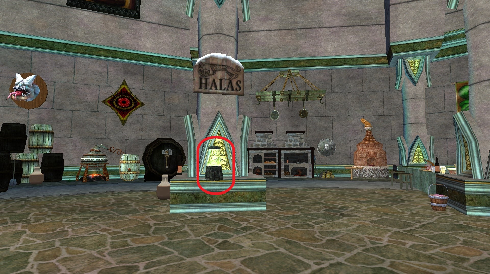
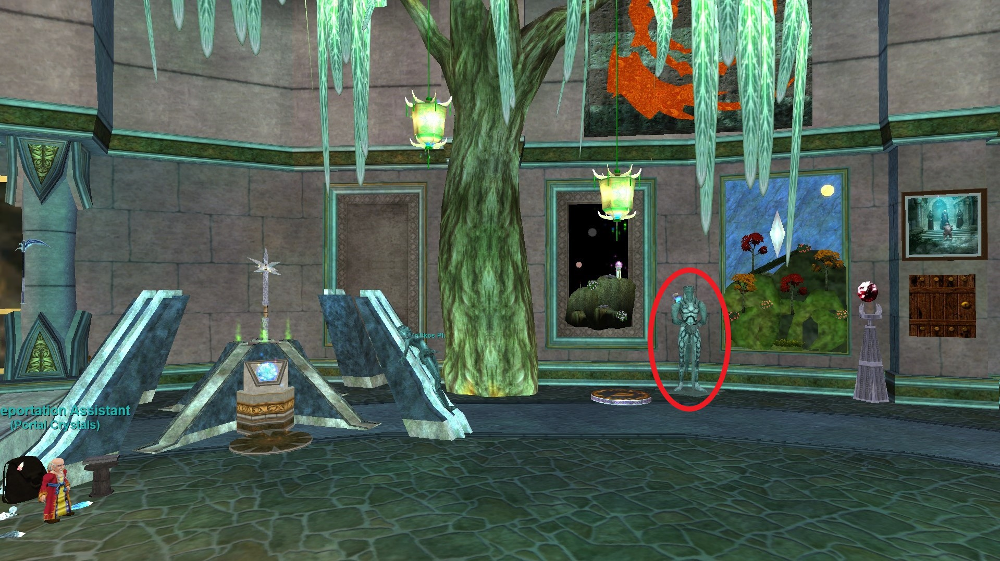
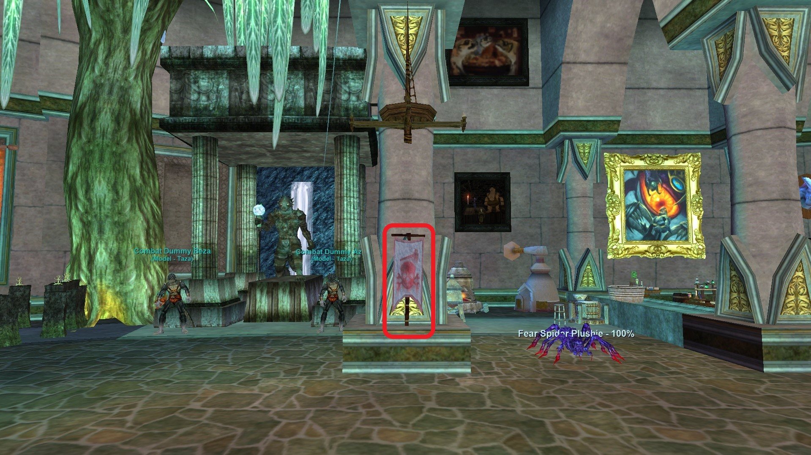
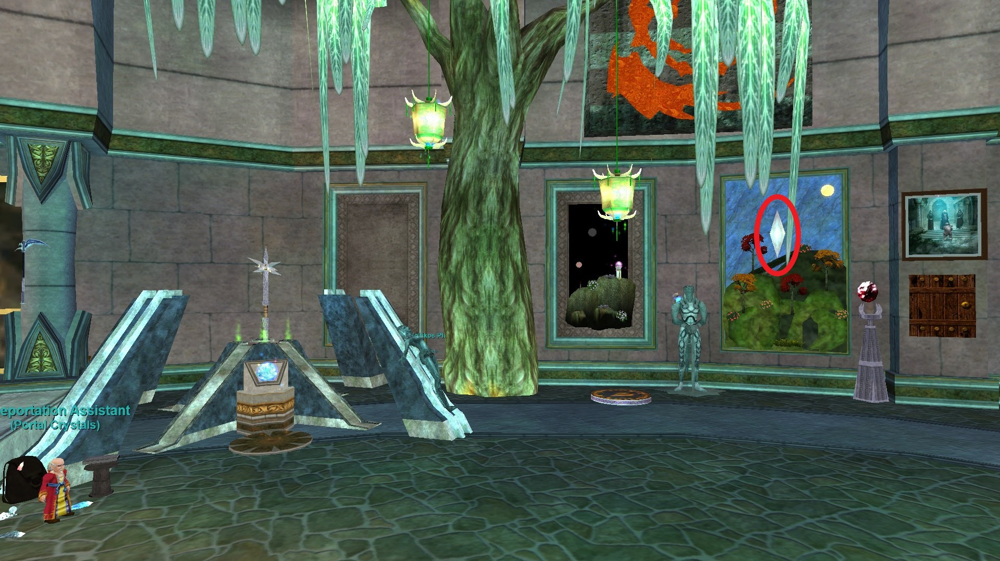
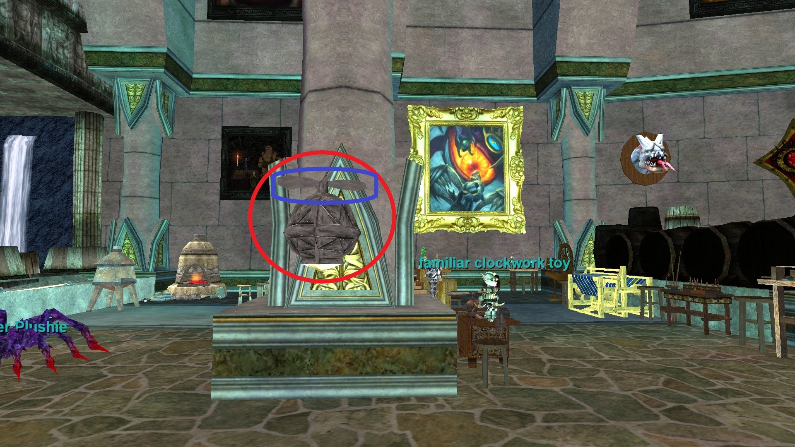

# Guide to Porting using portals, clickies, and spells

This document will list zones that can be ported to using various
methods. These methods include the Guild Hall Teleportation Device,
specific portals spread around the RotE guild hall, personal clickies, and
spells.

Skip to [Zones](#zones)

## Guild Teleportation Device

This is set by handing the Teleportation Assistant a specific portal crystal
for the destination zone. Once set, it remains that way until either someone
resets it or the zone is reset (no one in GH for some length of time or
sever reboot). He sells the portal crystals.

## Portal Objects

There are several portal objects in the guild hall. Images showing the
general area and the specific item to right-click and select 'Teleport
to ZONE' are included. The images here were taken from the RotE guild
hall. Advantages of the Portal Objects are that you don't have to buy
something to set it and you don't have to change the Guild Port. This is
especially useful to avoid changing it during raid times.

Many of these portal objects may be used from inventory. When clicked from
inventory there is usually a long timeout. When placed in real estate, there
is no timeout and can also be used by others. For purposes of this document,
they will be listed under portals.

## Clickies

There are are many clickies that players can use from inventory. Some are
found in game, some are included when buying certain versions of an
expansion, and some are rewards. (See Portal Object note above concerning
clickies)

## Spells (Druid, Wizard)

In some cases, may be more convenient to where you want to go. With the addition
of the GH teleportation device and all the crate portal objects, there are often
equivalent or better choices than a porting class.

# Zones

- Guild Standard - Ports to where guild banner is placed
    - GH Port - Splinter of a Guild Banner
- Abysmal Sea
    - 

        
        
Portal - The Grozmok Stone

      

    - 

        
        
Map

      

- Arcstone
    - GH Port - Arcstone Spirit Sapphire
    - Druid - Ring of Arcstone / Circle of Arcstone / Zephyr: Arcstone
- Ak'Anon
    - 

        
        
Portal - Ak'Anon Bubble Lamp

      

    - 

        
        
Map

      

- Argath, Bastion of Ildaera
    - GH Port - Chunk of Argathian Steel
- Barindu, Hanging Gardens
    - GH Port - Etched Marble of Barindu
    - Druid - Ring of Barindu / Circle of Barindu / Zephyr: Barindu
- Brell's Rest
    - GH Port - Unrefined Brellium Ore
    - Clicky - Mark of Brell
    - Druid - Ring of Brell’s Rest / Circle of Brell’s Rest / Zephyr: Brell’s Rest
- Cobalt Scar
    - GH Port - Velium Shard of Cobalt Scar
    - Druid - Ring of Cobalt Scar / Circle of Cobalt Scar / Zephyr: Cobalt Scar
- The Commonlands
    - GH Port - Grassy Pebble of The Commonlands
    - Druid - Ring of Commmons / Circle of Commons / Zephyr: Commonlands
- Dragonscale Hills
    - GH Port - Dragonscale Faycite
- The Dreadlands
    - GH Port - Shattered Bone of the Dreadlands
    - Druid - Ring of the Combines / Circle of the Combines / Zephyr: Combines
- Ethernere Tainted West Karana
    - GH Port - Stormstone of the West
    - Druid - Ring of West Karana / Circle of West Karana / Zephyr: West Karana
- Feerrott, the Dream
    - GH Port - Crystallized Dream of the Feerrott
- Frontier Mountains (EoK)
    - 

        
        
Portal - Ancient Iksar Translocator Statue

      

    - 

        
        
Clicky - Ancient Iksar Translocator Stone

      

    - 

        
        
Map

      

- Goru'kar Mesa
    - GH Port - Goru’kar Mesa Sandstone
- Greater Faydark
    - GH Port - Forest Emerald of Faydark
- Iceclad Ocean
    - GH Port - Frozen Shard of Iceclad
    - 

        
        
Portal - Banner: Gnome Pirates

      

    - Druid - Ring of Iceclad / Circle of Iceclad / Zephyr: Iceclad
    - 

        
        
Map

      

- Katta Castrum
    - GH Port - Katta Castrum Powerstone
- Katta Castrum: Deluge
    - GH Port - Drowned Katta Castrum Powerstone
- Lavastorm Mountains
    - GH Port - Lavastorm Magma
    - Druid - Ring of Lavastorm / Circle of Lavastorm / Zephyr: Lavastorm
- Lceanium
    - GH Port - Fragment of the Combine Spire
    - Druid - Ring of Lceanium / Circle of Lceanium / Zephyr: Lceanium
- North Karana
    - GH Port - Karana Plains Pebble
    - Ring of Karana / Circle of Karana / Zephry: Karana
- Shard's Landing
    - GH Port - Stone of the Shard's Fall
    - 

        
        
Clicky - Signet of the Crystal Circle

      

    - Druid - Ring of the Landing / Circle of the Landing / Zephyr: Shard's Landing
    - 

        
        
Map

      

- Stratos: Zephyr's Flight
    - GH Port - Burning Lamp
    - Portal - Stratos Fire Platform
    - Clicky - Stratos Air Platform
    - Clicky - Wishing Lamp: Zephyr's Flight
- The Stonebrunt Mountains
    - GH Port - Moss Agate of Stonebrunt
    - Druid - Ring of Stonebrunt / Circle of Stonebrunt / Zephyr: Stonebrunt
- Surefall Glade
    - 

        
        
Portal - Brazier: The Everburning Ruby

      

    - 

        
        
Map

      

    - Druid - Ring of Surefall Glade / Circle of Surefall Glade / Zephyr: Surefall Glade
- The Overthere (RoS)
    - GH Port - Miniature Worker's Sledge
- The Plane of Hate
    - GH Port - Fuligan Soulstone of Innoruuk
- The Plane of Health
    - 

        
        
Portal - Cynosure of Health

      

    - 

        
        
Clicky - Touchstone of Health

      

    - 

        
        
Map

      

- The Plane of Innovation
    - 

        
        
Portal - Innovative Heli-Lamp

      

    - 

        
        
Map

      

- The Plane of Sky
    - GH Port - Cloudy Stone of Veeshan
- The Plane of Time
    - GH Port - Broken Timestone
    - Druid - Ring of Plane of Time / Circle of Plane of Time / Zephyr: Plane of Time
- The Twilight Sea
    - GH Port - Shadowed Sand of the Twilight Sea
    - Druid - Ring of Twilight / Circle of Twilight / Zepher: Twilight
- Toxxulia Forest
    - GH Port - Opal of Toxxulia
    - Druid - Ring of Toxxulia / Circle of Toxxulia / Zephyr: Toxxulia
- The Undershore
    - GH Port - Undershore Coral
    - Druid - Ring of Undershore / Circle of Undershore / Zephyr: Undershore
- Wall of Slaughter
    - GH Port - Chipped Shard of Slaughter
    - Druid - Ring of Slaugher / Circle of Slaughter / Zephyr: Slaughter)
