# Guide to Porting using portals, clickies, and spells

This document will list zones that can be ported to using various
methods. These methods include the Guild Hall Teleportation Device,
other portals spread around the RotE guild hall, personal clickies, and
spells.

Skip to [Zones](#Zones)

## Guild Teleportation Device

This is set by handing the Teleportation Assistant a specific piece for
the destination zone. Once set, it remains that way until either someone
resets it or the zone is reset (no one in GH for some length of time or
sever reboot). He sells the necessary items to hand back to set the portal.

## Portal Objects

There are several portal objects in the guild hall. Images showing the
general area and the specific item to right-click and select 'Teleport
to ZONE' are included. The images here were taken from the RotE guild
hall.

## Clickies

There are are many clickies that players may use from inventory. Some are
found in game, some are included when buying certain versions of an
expansion, and some are rewards.

## Zones

- [Abysmal Sea](#Abysmal-Sea) (Portal)
- [Ak'Anon](#AkAnon) (Portal)
- [Frontier Mountains (EoK)](#Frontier-Mountains-EoK) (Portal, Clicky)
- [Iceclad Ocean](#Iceclad-Ocean) (Guild Port, Spell, Portal)
- [Shard's Landing](#Shards-Landing) (Guild Port, Spell, Clicky)
- [Surefall Glade](#Surefall-Glade) (Spell, Portal)
- [The Plane of Health](#The-Plane-of-Health) (Portal, Clicky)
- [The Plane of Innovation](#The-Plane-of-Innovation) (Portal)

## Detailed information

### Abysmal Sea

Had two in GH, locations below.

Portal - The Grozmok Stone:
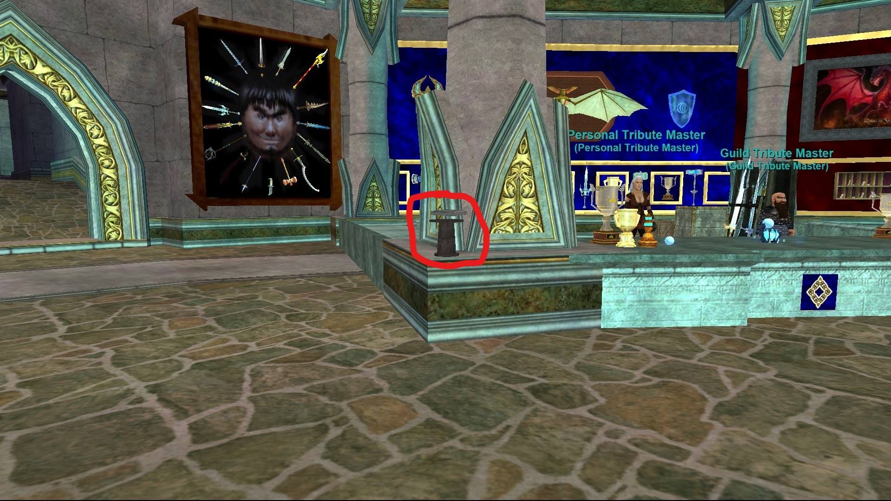
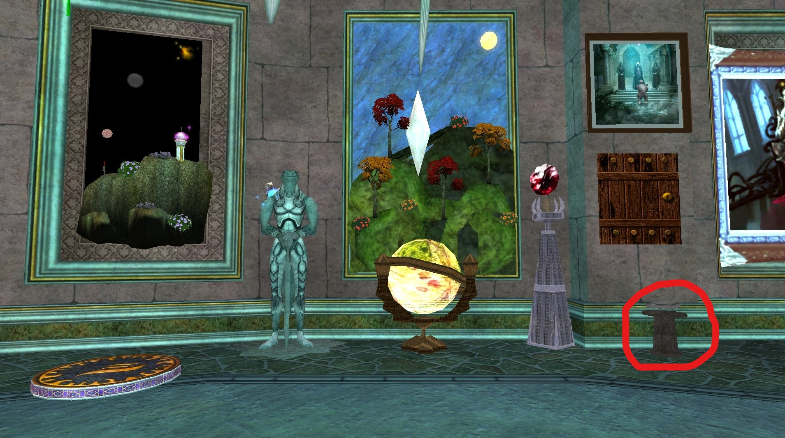

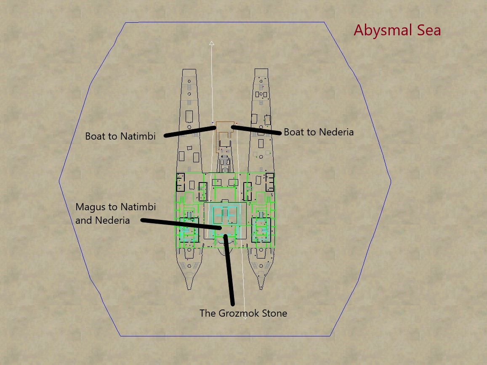

---

### Ak'Anon

Portal - Ak'Anon Bubble Lamp:
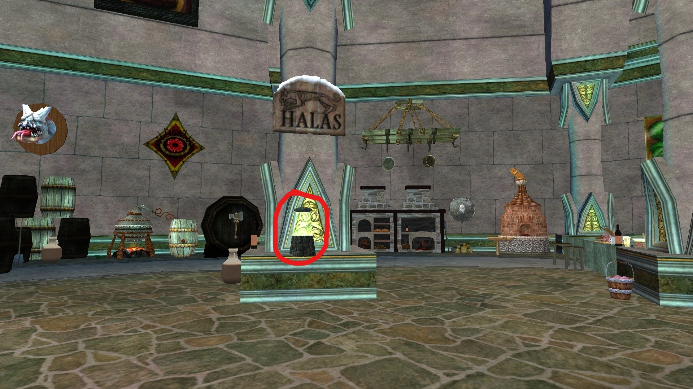

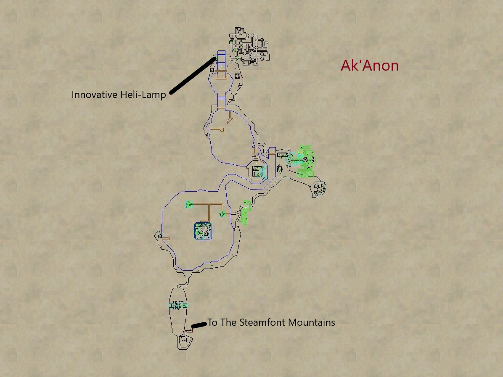

---

### Frontier Mountains (EoK)

Portal - Ancient Iksar Translocator Statue:

Clicky - Ancient Iksar Translocator Stone:

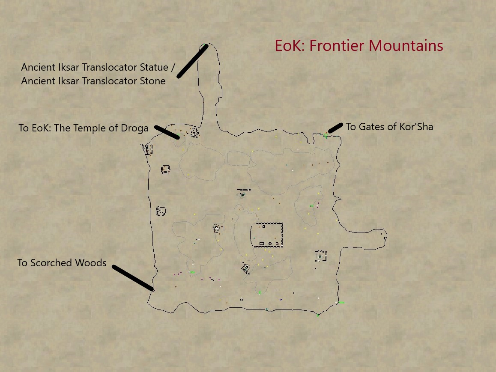

---

### Iceclad Ocean

Teleporter Stone - Frozen Shard of Iceclad

Druid ports - Ring of Iceclad / Circle of Iceclad / Zephyr Iceclad

Portal - Banner Gnome Pirates:
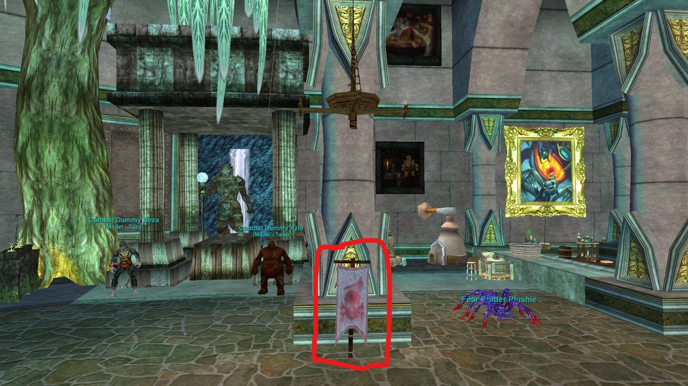

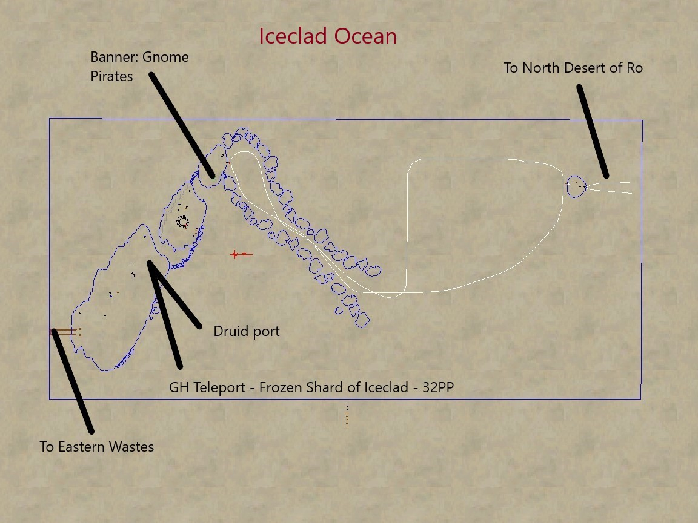

---

### Shard's Landing

Teleporter Stone - Stone of the Shard's Fall

Druid ports - Ring of the Landing / Circle of the Landing / Zephyr Shard's Landing

Clicky - Signet of the Crystal Circle:
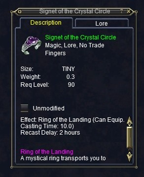

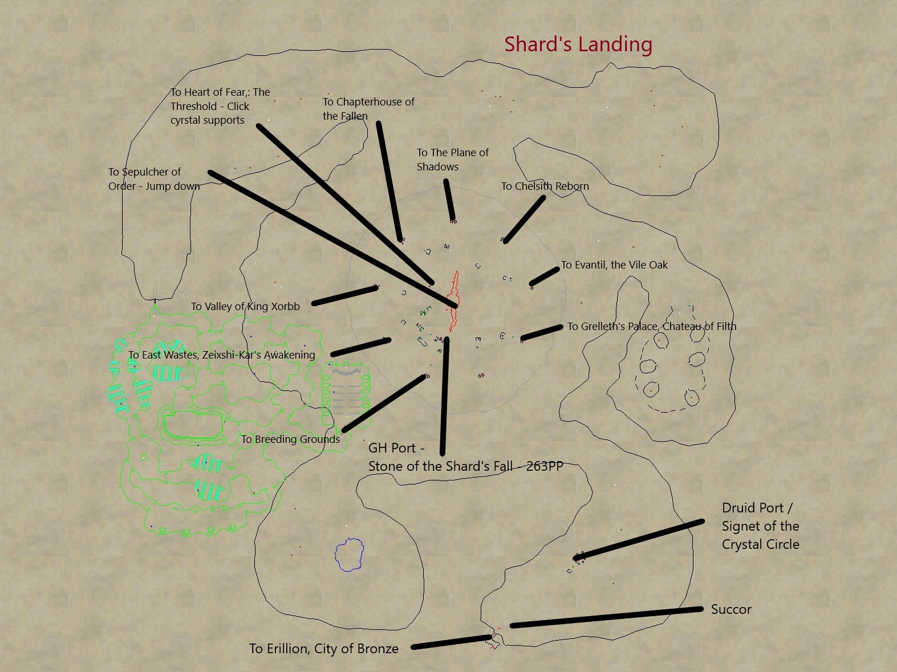

---

### Surefall Glade

Druid ports - Ring of Surefall Glade / Circle of Surefall Glade / Zephyr Surefal Glade

Portal - Brazier: The Everburning Ruby:
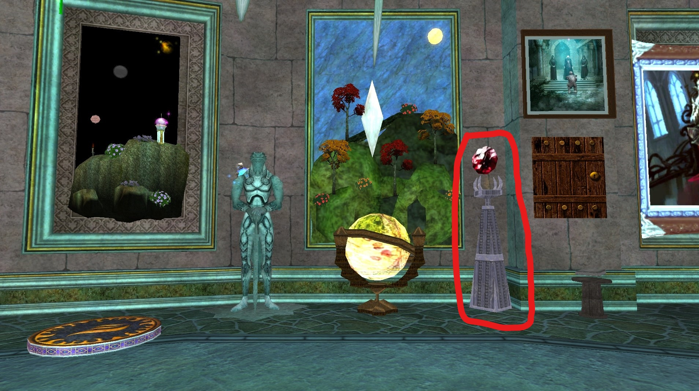

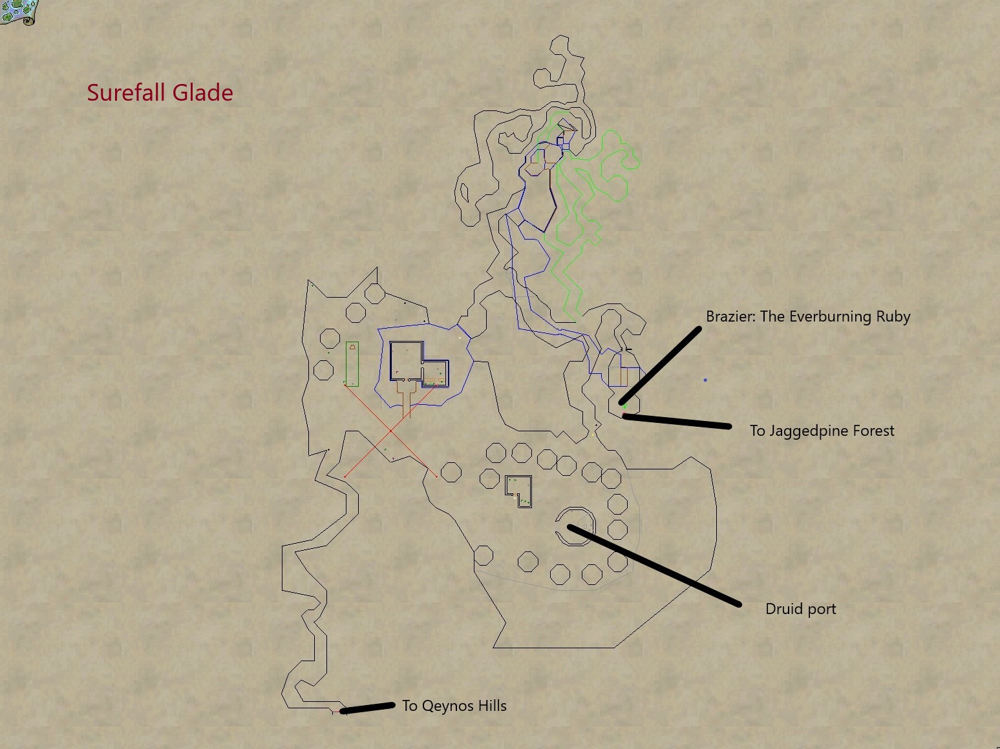

---

### The Plane of Health

Portal - Cynosure of Health:
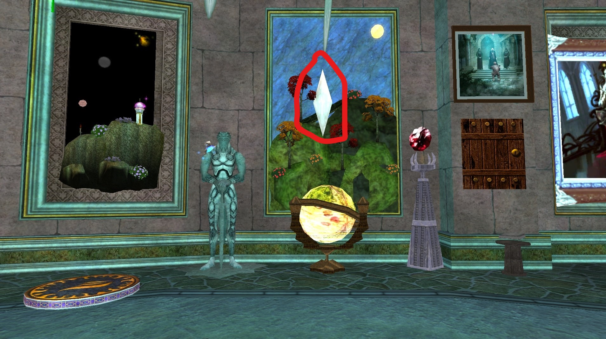

Clicky - Touchstone of Health:
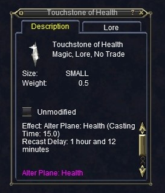

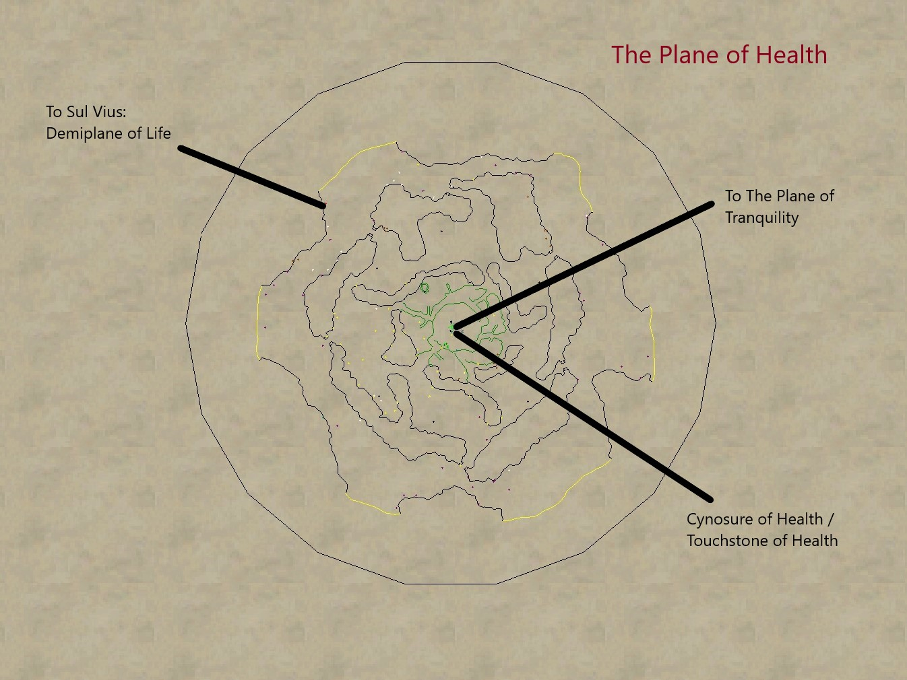

---

### The Plane of Innovation

For the portal below - target area is the propellers inside the
yellow area. Best to approach from the view shown as an angle
view seems to select stuff behind it instead of the lamp.
(They messed up the target)

Portal - Innovative Heli-Lamp:
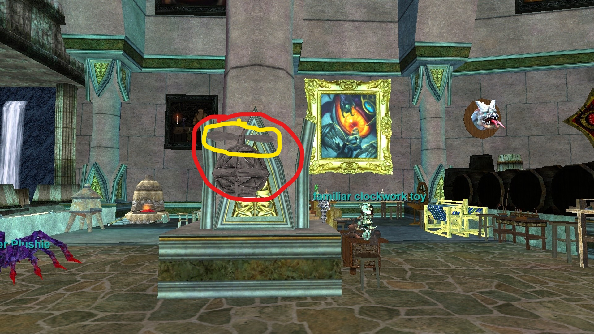

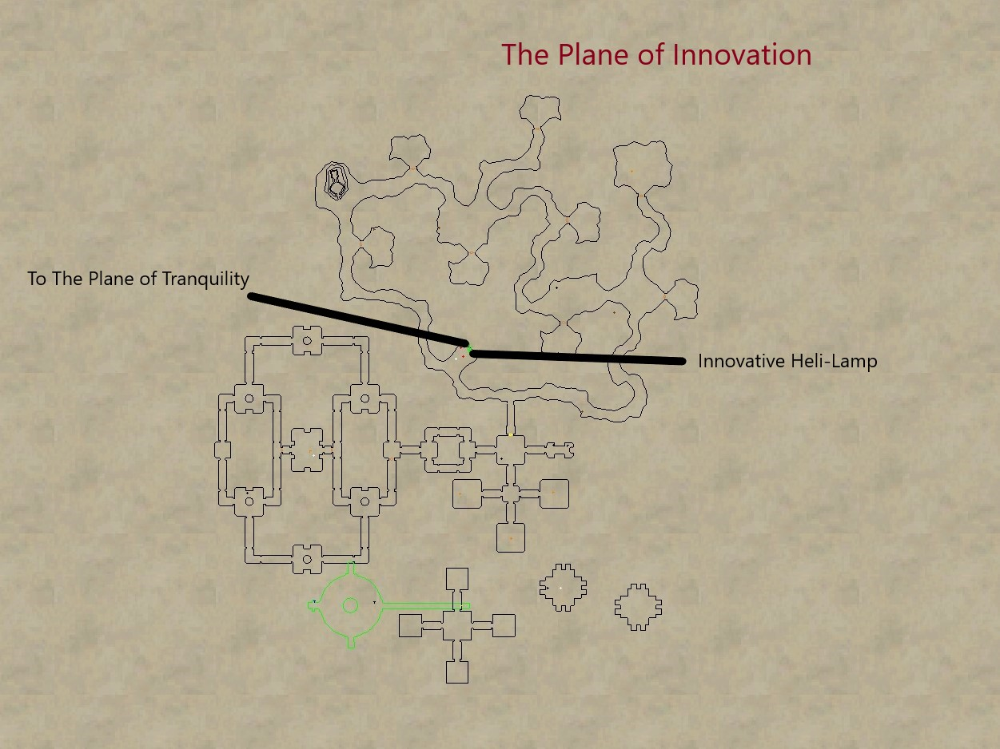
