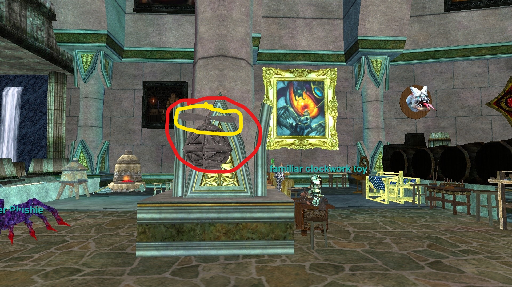
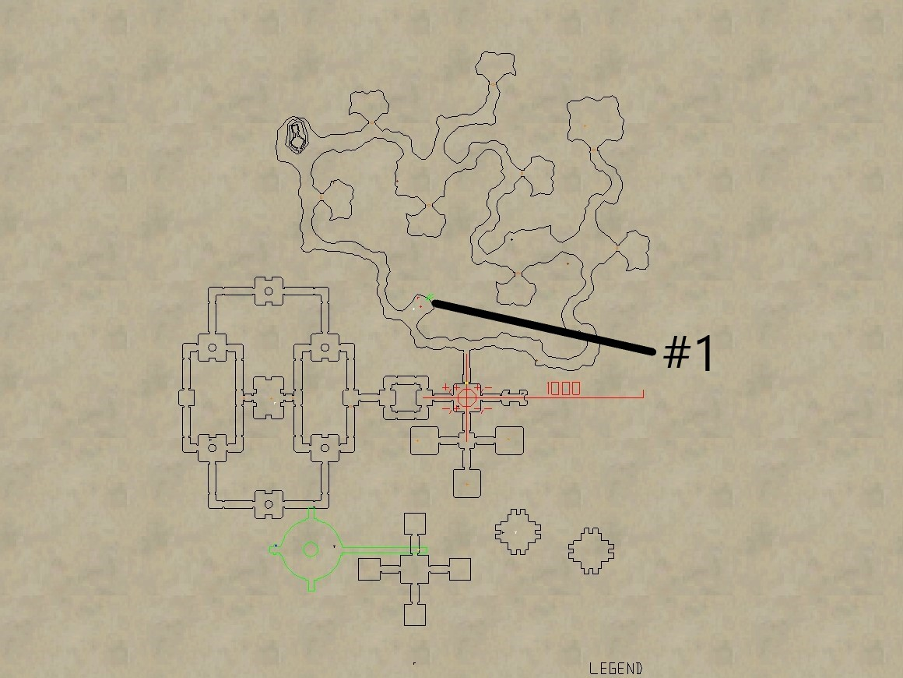

# Guild Hall Portals

There are two types of porting from the guild hall.  One is the Guild
Teleportation Device and the other is any one of the various porting
objects placed around the guild hall. This page will attempt to show
each of the objects and where they port to.

## Guild Teleportation Device

This is set by handing the Teleportation Assistant a specific piece for
the destination zone. Once set, it remains that way until either someone
resets it or the zone is reset (no one in GH for some length of time or
sever reboot). He sells the necessary items to hand back to set the portal.

## Portal Objects

There are several portal objects in the guild hall. Images showing the
general area and the specific item to right-click and select 'Teleport
to ZONE' are included.

## Zones

- [Abysmal Sea](#Abysmal-Sea)
- [Ak'Anon](#AkAnon)
- [Plane of Innovation](#Plane-of-Innovation)

## Full information

### Abysmal Sea

Had two in GH, locations below.

Portal - The Grozmok Stone -> Spot #1 (outside):

Portal - The Grozmok Stone -> Spot #1 (outside):

Abysmal Sea Map:

---

### Ak'Anon

Portal - Ak'Anon Bubble Lamp -> Spot #1:

Ak'Anon Map:

---

### Plane of Innovation

For the portal below - target area is the propellers inside the
yellow area. Best to approach from the view shown as an angle
view seems to select stuff behind it instead of the lamp.
(They messed up the target)

Portal - Innovative Heli-Lamp -> Spot #1 (near zone out):

Plane of Innovation Map:

