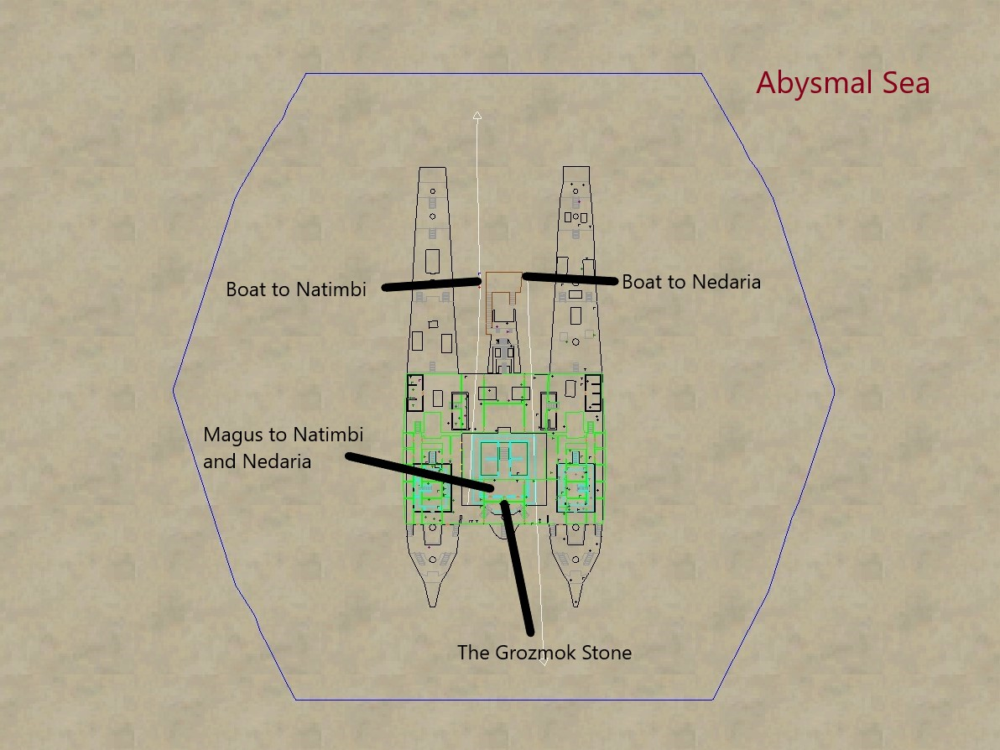
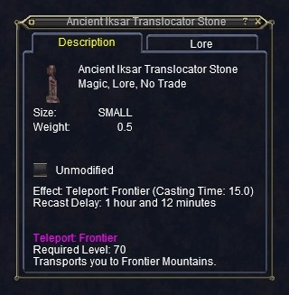

# Guide to Porting using portals, clickies, and spells

This document will list zones that can be ported to using various
methods. These methods include the Guild Hall Teleportation Device,
specific portals spread around the RotE guild hall, personal clickies, and
spells.

Skip to [Zones](#zones)

## Guild Teleportation Device (G)

This is set by handing the Teleportation Assistant a specific portal crystal
for the destination zone. Once set, it remains that way until either someone
resets it or the zone is reset (no one in GH for some length of time or
sever reboot). He sells the portal crystals.

## Spells (D = Druid, W = Wizard)

In some cases, may be more convenient to where you want to go. With the addition
of the GH teleportation device and all the crate portal objects, there are often
equivalent or better choices than a porting class.

## Portal Objects (P)

There are several portal objects in the guild hall. Images showing the
general area and the specific item to right-click and select 'Teleport
to ZONE' are included. The images here were taken from the RotE guild
hall. Advantages of the Portal Objects are that you don't have to buy
something to set it and you don't have to change the Guild Port. This is
especially useful to avoid changing it during raid times.

Many of these portal objects may be used from inventory. When clicked from
inventory there is usually a long timeout. When placed in real estate, there
is no timeout and can also be used by others. For purposes of this document,
they will be listed under portals.

## Clickies (C)

There are are many clickies that players can use from inventory. Some are
found in game, some are included when buying certain versions of an
expansion, and some are rewards. (See Portal Object note above concerning
clickies)

# Zones

- Guild Standard - Ports to where guild banner is placed
    - GH Port - Splinter of a Guild Banner
- Abysmal Sea
    - Portal - [The Grozmok Stone](#the-grozmok-stone)
    - [Map](#abysmal-sea-map)
- Arcstone
    - GH Port - Arcstone Spirit Sapphire
    - Druid - Ring of Arcstone / Circle of Arcstone / Zephyr: Arcstone
- [Argath, Bastion of Ildaera](#argath-bastion-of-ildaera) (G)
- [Ak'Anon](#akanon) (P)
- [Barindu, Hanging Gardens](#barindu-hanging-gardens) (G, D)
- [Brell's Rest](#brells-rest) (G, D, C)
- [Cobalt Scar](#cobalt-scar) (G, D)
- [The Commonlands](#the-commonlands) (G, D)
- [Dragonscale Hills](#dragonscale-hills) (G)
- [Dreadlands](#dreadlands) (G, D)
- [Ethernere Tainted West Karana](ethernere-tainted-west-karana) (G, D)
- [Feerrott, the Dream](#feerrott-the-dream) (G)
- [Frontier Mountains (EoK)](#frontier-mountains-eok) (P, C)
- [Goru'kar Mesa](#gorukar-mesa) (G)
- [Greater Faydark](#greater-faydark) (G)
- [Iceclad Ocean](#iceclad-ocean) (G, D, P)
- [Katta Castrum](#katta-castrum) (G)
- [Katta Castrum: Deluge](#katta-castrum-deluge) (G)
- [Lavastorm Mountains](#lavastorm-mountains) (G, D)
- [Lceanium](#lceanium) (G, D)
- [North Karana](#north-karana) (G, D)
- [Shard's Landing](#shards-landing) (G, D, C)
- [Stratos: Zephyr's Flight](#stratos-zephyrs-flight) (G, P, C)
- [The Stonebrunt Mountains](#the-stonebrunt-mountains) (G, D)
- [Surefall Glade](#surefall-glade) (D, P)
- [The Overthere (RoS)](#the-overthere-ros) (G)
- [The Plane of Hate](#the-plane-of-hate) (G)
- [The Plane of Health](#the-plane-of-health) (P, C)
- [The Plane of Innovation](#the-plane-of-innovation) (P)
- [The Plane of Sky](#the-plane-of-sky) (G)
- [The Plane of Time](#the-plane-of-time) (G)
- [The Twilight Sea](#the-twilight-sea) (G, D)
- [Toxxulia Forest](#toxxulia-forest) (G, D)
- [The Undershore](#the-undershore) (G, D)
- [Wall of Slaughter](#wall-of-slaughter) (G, D)

## Detailed information

### Guild Standard

This ports you to where the standard has been placed.

GH TP - Splinter from a Guild Standard

### Abysmal Sea

Portal - The Grozmok Stone:

---

### Ak'Anon

Portal - Ak'Anon Bubble Lamp:

---

### Arcstone

GH TP - Arcstone Spirit Sapphire

Druid - Ring of Arcstone / Circle of Arcstone / Zephyr: Arcstone

---

### Argath, Bastion of Ildaera

GH TP - Chunk of Argathian Steel

---

### Barindu, Hanging Gardens

GH TP - Etched Marble of Barindu

Druid - Ring of Barindu / Circle of Barindu / Zephyr: Barindu

---

### Brell's Rest

GH TP - Unrefined Brellium Ore

Druid - Ring of Brell's Rest / Circle of Brell's Rest / Zephyr: Brell's Rest

---

### Cobalt Scar

GH TP - Velium Shard of Cobalt Scar

Druid - Ring of Cobalt Scar / Circle of Cobalt Scar / Zephyr: Cobalt Scar

---

### Dragonscale Hills

GH TP - Dragonscale Faycite

---

### Dreadlands

GH TP - Shattered Bone of the Dreadlands

Druid - Ring of the Combines / Circle of the Combines / Zephyr: Combines

---

### Ethernere Tainted West Karana

GH TP - Stormstone of the West

Druid - Ring of West Karana / Circle of West Karana / Zephyr: West Karana

---

### Feerrott, the Dream

GH TP - Crystallized Dream of the Feerrott

---

### Frontier Mountains (EoK)

Portal - Ancient Iksar Translocator Statue:

Clicky - Ancient Iksar Translocator Stone:

---

### Goru'kar Mesa

GH TP - Goru'kar Mesa Sandstone

---

### Greater Faydark

GH TP - Forest Emerald of Faydark

---

### Iceclad Ocean

GH TP - Frozen Shard of Iceclad

Druid - Ring of Iceclad / Circle of Iceclad / Zephyr: Iceclad

Portal - Banner Gnome Pirates:

---

### Lavastorm Mountains

GH TP - Lavastorm Magma

Druid - Ring of Lavastorm / Circle of Lavastorm / Zephyr: Lavastorm

---

### Lceanium

GH TP - Fragment of the Combine Spire

Druid - Ring of Lceanium / Circle of Lceanium / Zephyr: Lceanium

---

### North Karana

GH TP - Karana Plains Pebble

Druid - Ring of Karana / Circle of Karana / Zephry: Karana

---

### Katta Castrum

GH TP - Katta Castrum Powerstone

---

### Katta Castrum: Deluge

GH TP - Drowned Katta Castrum Powerstone

---

### Shard's Landing

GH TP - Stone of the Shard's Fall

Druid - Ring of the Landing / Circle of the Landing / Zephyr: Shard's Landing

Clicky - Signet of the Crystal Circle:

---

### Stratos: Zephyr's Flight

GH TP - Burning Lamp

Portal - Stratos Fire Platform

Clicky - Stratos Air Platform

Clicky - Wishing Lamp: Zephyr's Flight

---

### The Stonebrunt Mountains

GH TP - Moss Agate of Stonebrunt

Druid - Ring of Stonebrunt / Circle of Stonebrunt / Zephyr: Stonebrunt

---

### Surefall Glade

Druid - Ring of Surefall Glade / Circle of Surefall Glade / Zephyr: Surefall Glade

Portal - Brazier: The Everburning Ruby:

---

### The Commonlands

GH TP - Grassy Pebble of the Commmonlands

Druid - Ring of Commons / Circle of Commons / Zephyr: Commonlands

---

### The Overthere (RoS)

GH TP - Miniature Worker's Sledge

---

### The Plane of Hate

GH TP - Fuligan Soulstone of Innoruuk

---

### The Plane of Health

Portal - Cynosure of Health:

Clicky - Touchstone of Health:

---

### The Plane of Innovation

For the portal below - target area is the propellers inside the
yellow area. Best to approach from the view shown as an angle
view seems to select stuff behind it instead of the lamp.
(They messed up the target)

Portal - Innovative Heli-Lamp:

---

### The Plane of Sky

GH TP - Cloudy Stone of Veeshan

---

### The Plane of Time

GH TP - Broken Timestone

Druid - Ring of Plane of Time / Circle of Plane of Time / Zephyr: Plane of Time

---

### The Twilight Sea

GH TP - Shadowed Sand of the Twilight Sea

Druid - Ring of Twilight / Circle of Twilight / Zepher: Twilight

---

### Toxxulia Forest

GH TP - Opal of Toxxulia

Druid - Ring of Toxxulia / Circle of Toxxulia / Zephyr: Toxxulia

---

### The Undershore

GH TP - Undershore Coral

---

### Wall of Slaughter

GH TP - Chipped Shard of Slaughter

Druid - (Ring of Slaugher, Circle of Slaughter, Zephyr: Slaughter)
